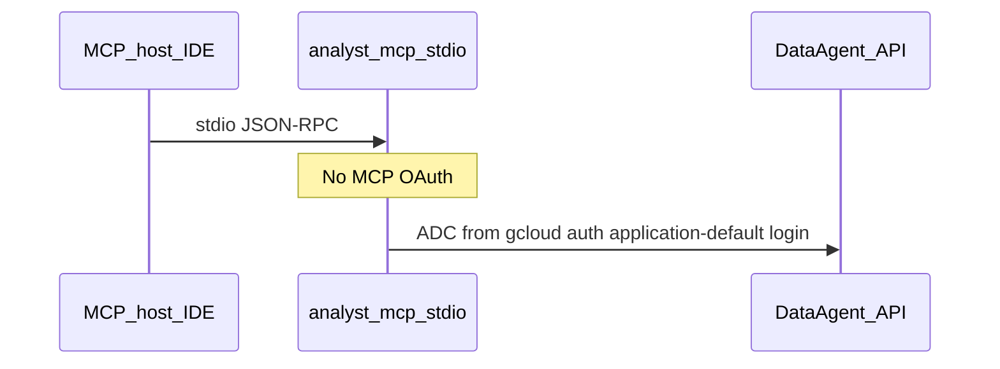
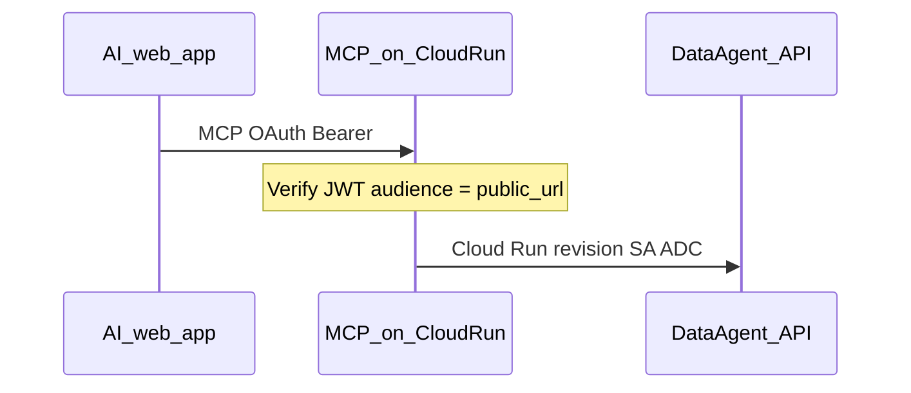
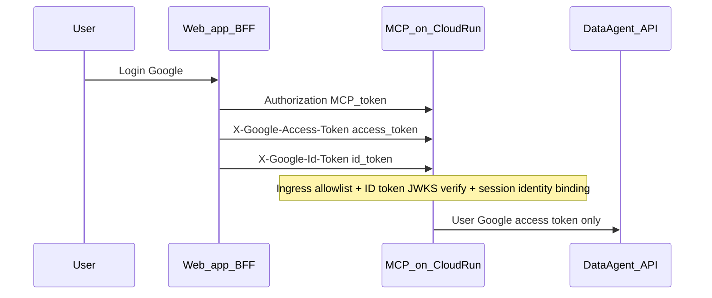

# ADR 0001: Dual-layer authentication (MCP ingress vs Data Agent egress)

## Status

Accepted

## Context

MCP servers expose tools over **stdio** or **HTTP**. Calls to `geminidataanalytics.googleapis.com` require separate Google credentials. These two hops serve different purposes and must not be conflated.

- **Ingress:** Who may invoke MCP tools? (MCP OAuth on HTTP; local trust on stdio.)
- **Egress:** Which GCP principal does the Data Agent API authorize? (ADC, SA impersonation, or end-user token.)

The [MCP authorization specification](https://modelcontextprotocol.io/specification/2025-06-18/basic/authorization) forbids **token passthrough**: the MCP access token must not be forwarded to upstream Google APIs.

## Decision

Model authentication as **two layers** with an explicit **egress `auth.mode`** per agent:

| `auth.mode`     | Transports    | Egress caller                                                              |
| --------------- | ------------- | -------------------------------------------------------------------------- |
| `adc`           | stdio, http   | Application Default Credentials (user laptop ADC or Cloud Run revision SA) |
| `impersonation` | stdio, http   | Target service account via source ADC                                      |
| `user_token`    | **http only** | End-user Google access token from a separate HTTP header                   |

HTTP ingress always uses `server.oauth` when `transport: http` (except local CI smoke with `oauth.enabled: false` on loopback).

### Use-case catalog

#### UC1 — Stdio + ADC



#### UC2 — Stdio + SA impersonation

Same as UC1; egress impersonates a target service account.

#### UC3 — HTTP + platform SA (Cloud Run)



#### UC4 — HTTP + impersonation

Same as UC3; Cloud Run SA impersonates a data-plane SA.

#### UC5 — HTTP + user token (bound BFF)



Default headers:

- `X-Google-Access-Token` — Google **access token** for Data Agent API egress (configurable via `server.http.google_access_token_header`)
- `X-Google-Id-Token` — Google **ID token** for identity binding (configurable via `server.http.google_id_token_header`)

Google API access tokens are opaque credentials; they are **not** RFC 7662 introspection tokens. Identity binding verifies the ID token locally against Google JWKS (`iss`, `aud`, `exp`, `sub`, optional `hd`, optional `at_hash`).

`server.http.user_token` is **required** when any agent uses `auth_mode: user_token`:

- `trusted_ingress_client_ids` — only listed MCP JWT `azp`/`client_id` values may call user_token agents
- `google_identity` — expected ID token `issuer`, allowed `audiences`, optional `jwks_uri`, optional `hosted_domain`, optional `verify_at_hash`
- `binding.mode` — `ingress_client_only` or `google_sub_matches_mcp_sub` (MCP JWT `sub` must match ID token `sub`)

**One HTTP server = one egress auth domain.** Configurations mixing `user_token` agents with `adc`/`impersonation` agents are rejected at load time (`CONFIG_MIXED_AUTH_MODES_UNSUPPORTED`). Deploy separate MCP endpoints or servers for platform vs user-delegated tools.

The HTTP session stores a validated Google identity tuple; later requests with a different Google principal are rejected.

#### UC6 — HTTP agent identity

Variant of UC3: dedicated agent service account per deployment; MCP OAuth identifies the client application.

#### UC7 — A2A agent as MCP client

[A2A](https://github.com/a2aproject/A2A/blob/main/docs/topics/enterprise-ready.md) declares security on the Agent Card; credentials are acquired out-of-band. An orchestrator maps to UC5 (user IAM) or UC3 (agent SA).

#### UC8 — Local HTTP smoke

`oauth.enabled: false` + `MCP_ALLOW_INSECURE_HTTP` on loopback. Egress still uses ADC/impersonation. Not for production.

### Configuration matrix

| UC  | Transport | MCP ingress    | `auth.mode`          | GCP caller on API   |
| --- | --------- | -------------- | -------------------- | ------------------- |
| 1   | stdio     | none           | `adc`                | User ADC            |
| 2   | stdio     | none           | `impersonation`      | Target SA           |
| 3   | http      | OAuth          | `adc`                | Cloud Run / host SA |
| 4   | http      | OAuth          | `impersonation`      | Target SA           |
| 5   | http      | OAuth          | `user_token`         | End user            |
| 6   | http      | OAuth          | `adc` + agent SA IAM | Agent SA            |
| 8   | http      | disabled smoke | `adc`                | Local ADC           |

### YAML examples

Stdio (default):

```yaml
agents:
  my-agent:
    data_agent: projects/p/locations/l/dataAgents/a
    tools: [query_data_agent]
```

HTTP + user token:

```yaml
server:
  transport: http
  public_url: https://mcp.example.com/mcp
  oauth:
    issuer: https://auth.example.com/
    allowed_audiences: [https://mcp.example.com/mcp]
  http:
    user_token:
      trusted_ingress_client_ids: [bff-client-id]
      google_identity:
        issuer: https://accounts.google.com
        audiences: [google-oauth-client-id]
        jwks_uri: https://www.googleapis.com/oauth2/v3/certs
        verify_at_hash: true
      binding:
        mode: google_sub_matches_mcp_sub
agents:
  my-agent:
    data_agent: projects/p/locations/l/dataAgents/a
    auth_mode: user_token
    tools: [query_data_agent]
```

## Consequences

### Positive

- Clear separation of MCP client auth vs Data Agent IAM.
- `user_token` enables user-attributed analytics on hosted HTTP without MCP token passthrough.
- Stdio and SA modes unchanged for local and automation use cases.

### Negative / limits

- `user_token` requires the BFF to send **both** a Google access token and ID token on every MCP HTTP request (no refresh vault yet).
- `user_token` requires `server.http.user_token` binding policy and HTTPS `public_url`.
- MCP ingress uses a **JWT-at-JWKS** profile only (`server.oauth.token_profile: jwt_jwks`); opaque MCP access tokens are not supported.
- In-memory HTTP sessions are **single-instance only**: multi-instance Cloud Run needs session affinity, an external session store, or clients must tolerate `404` on session reuse.

### Anti-patterns

- Forwarding the MCP Bearer token to `googleapis.com`.
- Assuming `roles/run.invoker` grants user-level Data Agent IAM.
- Using Cloud Run SA ADC when governance requires per-user IAM (use `user_token`).

## Future work (not Phase 1)

- Session-bound or vault-stored refresh tokens keyed by MCP `principalId`.
- Config guard when `K_SERVICE` is set and user-facing tools use `adc` egress.
