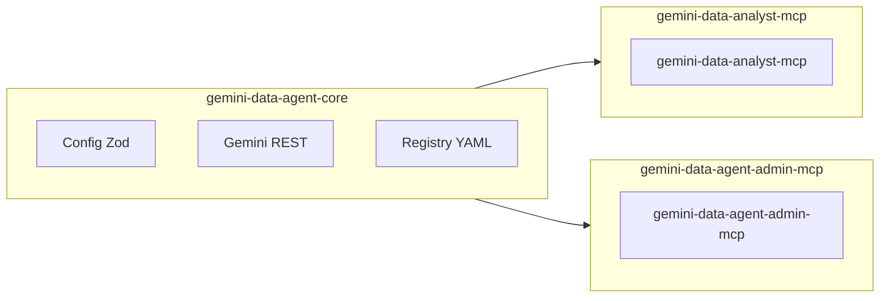
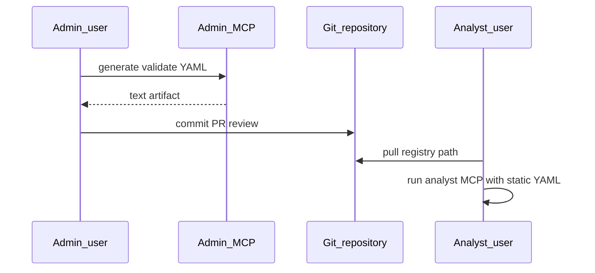

# 2. Role-separated Gemini Data Agent MCP packages (core, analyst, admin)

Date: 2026-04-29

## Status

Accepted

## Context

The repository originally shipped a single MCP package (`gemini-data-agent-mcp`) combining:

- Shared concerns (YAML config, Zod validation, ADC/impersonation auth, Gemini Data Agents REST client, redaction, audit logging).
- All MCP tools in one process—including analytical tools, session collaboration, optional raw REST passthrough, and anything operators might need for registry artifacts.

That coupling makes **least-privilege deployment** harder: data analysts and coding agents should not receive admin-capable tools or raw passthrough by default, while operators still need ways to produce and validate registry YAML for Git-based workflows without automating GitHub from the server.

We want:

- A **library** consumable without MCP or CLI frameworks for tests and future reuse.
- An **analyst-facing MCP** that reads a **static YAML registry** only and avoids escape hatches (`raw_data_agent_request`) and lifecycle/registry mutation tools.
- An **admin-facing MCP** that can generate, validate, and diff analyst registry YAML as **text** for humans to commit, plus placeholders for remote lifecycle APIs until the REST client supports them.

Backward compatibility with the old single binary name was explicitly **not** required mid-development.

## Decision

Split implementation into three workspace packages:

| Package                       | Responsibility                                                                                                                                                                                                                                                                                                      |
| ----------------------------- | ------------------------------------------------------------------------------------------------------------------------------------------------------------------------------------------------------------------------------------------------------------------------------------------------------------------- |
| `gemini-data-agent-core`      | Config schemas and loader, registry YAML serialize/parse/validate/diff, credential resolution, Gemini Data Agents HTTP client, redaction, audit helpers, response formatting. **No** `@modelcontextprotocol/sdk`, **no** MCP tool registration, **no** CLI parsing.                                                 |
| `gemini-data-analyst-mcp`     | MCP server for analysts: analytical tools, session tools, resources, prompts; **stdio** transport; logs on **stderr**. Does **not** register `raw_data_agent_request` or admin YAML tools. Binary: `gemini-data-analyst-mcp`.                                                                                       |
| `gemini-data-agent-admin-mcp` | MCP server for operators: `generate_analyst_registry_yaml`, `validate_analyst_registry_yaml`, `diff_analyst_registry_yaml`, `inspect_admin_auth`, `dry_run_data_agent_change`, and remote lifecycle tools returning `NOT_IMPLEMENTED` until wired. **No** GitHub automation. Binary: `gemini-data-agent-admin-mcp`. |

Remove the old monolithic package directory after migration; documentation and MCP client examples point at the new binaries.

### Architecture (high level)

### Registry promotion (manual)

## Consequences

### Positive

- Clear **trust boundaries**: analyst MCP surface excludes raw passthrough and admin-only tools by construction.
- **Single schema** for analyst registry YAML: admin generation and analyst consumption share `gemini-data-agent-core` validation.
- **Core library** enables focused unit tests without spinning up MCP.

### Negative / trade-offs

- **Two MCP processes** to configure when both roles are needed (separate MCP server entries in the client).
- **Breaking change** for anyone tied to the removed package name or old paths; mitigated by README and examples.
- Remote lifecycle behavior remains **stubbed** on the admin server until Gemini REST coverage exists; callers must handle `NOT_IMPLEMENTED`.

### Follow-ups

- Wire remote lifecycle tools to real APIs when available.
- Optionally publish npm package boundaries (`private` flags vs public publish) per release strategy.
